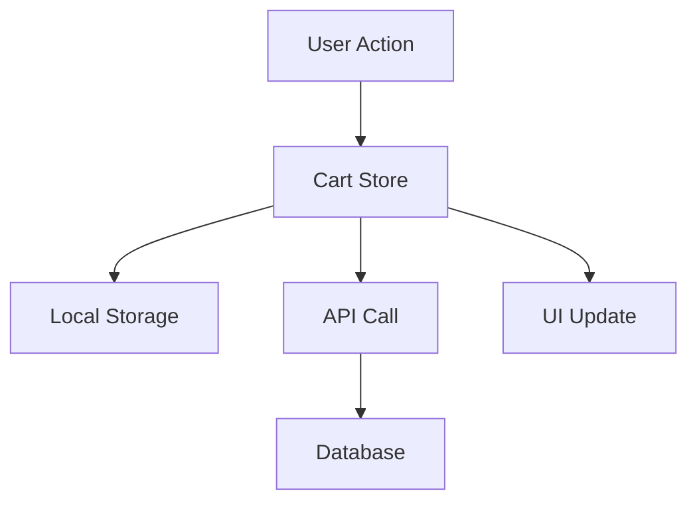

# Plan Master Skill

**Plan before you code. Validate before you execute.**

This skill provides a systematic approach to planning complex development tasks. It helps break down ambiguous requirements into actionable, sequenced steps with clear validation criteria.

---

## When to Plan vs Execute Directly

### Quick Decision Matrix

| Situation | Action | Why |
|-----------|--------|-----|
| Fix typo, rename variable | **Execute directly** | Trivial, no risk |
| Update single component props | **Execute directly** | Well-defined scope |
| Create new feature | **PLAN FIRST** | Unknown complexity, dependencies |
| Refactor core module | **PLAN FIRST** | High risk, needs validation |
| Migration (v3 → v4) | **PLAN FIRST** | Breaking changes, rollback strategy |
| Architecture change | **PLAN FIRST** | Affects multiple systems |
| Bug investigation unclear | **PLAN FIRST** | Unknown root cause |

### The 3-Question Test

Ask yourself:

1. **Do I know exactly what files to modify?**
   - Yes → Execute
   - No → Plan

2. **Could this break existing functionality?**
   - Yes → Plan
   - No → Execute

3. **Is the scope ambiguous or evolving?**
   - Yes → Plan
   - No → Execute

If **2+ answers suggest planning** → Use this skill first.

---

## The Planning Framework: P.L.A.N.

```
P - Probe        (Understand the problem)
L - Layout       (Design the architecture)
A - Assess       (Evaluate risks & dependencies)
N - Notify       (Present plan for validation)
```

---

## Phase 1: PROBE - Understand the Problem

### Information Gathering Checklist

Before writing any code, gather:

```markdown
□ User Requirements
  - What problem does this solve?
  - Who are the users?
  - What does success look like?

□ Technical Context
  - Existing similar features?
  - Current tech stack constraints?
  - Performance requirements?
  - Security considerations?

□ Scope Definition
  - What's IN scope?
  - What's OUT of scope?
  - MVP vs Future enhancements?

□ Constraints
  - Deadline?
  - Dependencies on other teams/features?
  - Budget/complexity limits?
```

### Questions to Ask the User

When requirements are unclear, ask:

1. **Priority**: "Is this MVP or can it be split?"
2. **Integration**: "Does it need to work with [existing feature]?"
3. **Data**: "Where does the data come from? API? Database?"
4. **Edge cases**: "What should happen when [X] fails?"
5. **Validation**: "How do you want to test this works?"

### Output: Requirements Document

```markdown
## Feature: User Authentication

### Goal
Allow users to sign up, log in, and reset passwords securely.

### In Scope ✅
- Email/password registration
- Login with JWT tokens
- Password reset via email
- Protected routes middleware

### Out of Scope ❌
- Social login (OAuth)
- 2FA/MFA
- Account deletion

### Technical Requirements
- Next.js 16 + Server Actions
- PostgreSQL for user data
- bcrypt for password hashing
- JWT tokens in httpOnly cookies

### Acceptance Criteria
- [ ] User can register with email/password
- [ ] User can log in and receives token
- [ ] Token expires after 24h
- [ ] Password reset email sent
- [ ] Routes protected with middleware

### Edge Cases
- Duplicate email registration
- Invalid password format
- Expired reset tokens
- SQL injection attempts
```

---

## Phase 2: LAYOUT - Design the Architecture

### Component Breakdown

Break the feature into logical components/modules:

```
Feature: Shopping Cart
│
├── Data Layer
│   ├── Types (Cart, CartItem)
│   ├── Store (Zustand/Context)
│   └── API (Server Actions)
│
├── UI Components
│   ├── CartIcon (badge count)
│   ├── CartDrawer (slide-out)
│   ├── CartItem (line item)
│   └── CartSummary (checkout)
│
├── Logic/Hooks
│   ├── useCart (main hook)
│   ├── useAddToCart
│   └── useRemoveFromCart
│
└── Integration
    ├── ProductCard (add button)
    └── CheckoutButton
```

### Dependency Graph

Identify what depends on what:

```
Types → Store → API
   ↓       ↓      ↓
   └──→ Components ←── Hooks
            ↓
        Integration
```

**Rule**: Build from bottom to top (dependencies first).

### File Structure Plan

```
src/
├── lib/
│   └── cart/
│       ├── types.ts        # Step 1
│       ├── store.ts        # Step 2 (depends on types)
│       └── utils.ts        # Step 2
├── app/
│   └── api/
│       └── cart/
│           └── route.ts    # Step 3 (depends on store)
├── components/
│   └── cart/
│       ├── CartIcon.tsx    # Step 4 (depends on store)
│       ├── CartDrawer.tsx  # Step 4
│       └── CartItem.tsx    # Step 4
└── hooks/
    └── useCart.ts          # Step 5 (depends on store)
```

### Technology Decisions

Document choices with justification:

| Decision | Options Considered | Choice | Rationale |
|----------|-------------------|--------|-----------|
| State Management | Context, Zustand, Redux | Zustand | Simpler, no boilerplate |
| Validation | Yup, Zod | Zod | TypeScript-first, smaller |
| Styling | CSS Modules, Tailwind | Tailwind | Consistent with project |

---

## Phase 3: ASSESS - Evaluate Risks & Dependencies

### Risk Analysis Matrix

| Risk | Impact | Likelihood | Mitigation |
|------|--------|------------|------------|
| Breaking change in auth | High | Medium | Feature flags, gradual rollout |
| Performance degradation | Medium | Low | Load testing before deploy |
| Data migration issues | High | High | Backup first, reversible |
| Third-party API failure | Medium | Medium | Fallback behavior, caching |

### Testing Strategy

Define what tests are needed and when:

```
Phase 1 (Data Layer):
  □ Unit tests for store methods
  □ Unit tests for utilities

Phase 2 (API Layer):
  □ Integration tests for endpoints
  □ Error handling tests

Phase 3 (UI):
  □ Component tests
  □ Accessibility tests

Phase 4 (Integration):
  □ E2E critical paths
  □ Performance benchmarks
```

### Rollback Plan

For risky changes, define rollback strategy:

```markdown
## Rollback Procedure

If deployment fails:

1. **Immediate** (if critical error):
   - Revert to previous commit: `git revert HEAD`
   - Redeploy immediately

2. **Database migrations**:
   - Always write DOWN migrations
   - Test rollback before deploy

3. **Feature flags**:
   - New features behind flags
   - Can disable without redeploy

4. **Data backup**:
   - Snapshot before migration
   - 24h retention minimum
```

---

## Phase 4: NOTIFY - Present Plan for Validation

### The Planning Document Template

Present this to the user for validation before execution:

```markdown
# Implementation Plan: [Feature Name]

## 📋 Summary
One-paragraph description of what will be built.

## 🎯 Goals
- Primary goal
- Secondary goals

## 📊 Complexity Estimate
- **Estimated Time**: X hours/days
- **Files to Create**: N
- **Files to Modify**: N
- **Risk Level**: Low/Medium/High

## 🏗️ Architecture
[Component breakdown diagram]

## 📁 File Structure
[Planned file structure]

## 📝 Implementation Steps

### Step 1: [Name] (~X min)
**Files**: `path/to/file.ts`
**Description**: What this step accomplishes
**Dependencies**: None (or list)
**Validation**: How to verify this step works

### Step 2: [Name] (~X min)
**Files**: `path/to/file.ts`
**Description**: ...
**Dependencies**: Step 1
**Validation**: ...

[Continue...]

## ⚠️ Risks & Mitigations
| Risk | Mitigation |
|------|------------|
| Risk 1 | How to handle |

## 🧪 Testing Plan
- Unit tests for: ...
- Integration tests for: ...
- E2E tests for: ...

## 🚀 Deployment Strategy
- Feature flag: Yes/No
- Gradual rollout: Yes/No
- Monitoring: What to watch
```

### Validation Questions for User

Before executing, confirm:

1. "Does this scope match your expectations?"
2. "Any missing edge cases or requirements?"
3. "Is the timeline estimate acceptable?"
4. "Should we prioritize any steps over others?"
5. "Any concerns about the technical approach?"

---

## Planning Patterns by Task Type

### Pattern A: New Feature Development

```
1. Requirements clarification
2. Data model design
3. API/Server Actions design
4. Component hierarchy
5. State management
6. Implementation order (dependencies first)
7. Testing strategy
8. Documentation
```

### Pattern B: Refactoring

```
1. Current state analysis (read all affected files)
2. Target state definition
3. Migration steps (incremental if possible)
4. Backward compatibility strategy
5. Testing approach (characterization tests first)
6. Rollback plan
```

### Pattern C: Migration

```
1. Inventory of affected code
2. Breaking changes analysis
3. Compatibility layer design (if needed)
4. Step-by-step migration phases
5. Data migration (if any)
6. Validation at each phase
7. Cleanup of old code
```

### Pattern D: Bug Fix (Complex)

```
1. Reproduction steps
2. Root cause analysis
3. Possible solutions comparison
4. Impact analysis (what else could break?)
5. Fix implementation
6. Regression tests
7. Prevention (how to avoid similar bugs)
```

---

## From Plan to Execution

### Converting Plan to Subagents

Once plan is validated, convert steps to subagent tasks:

```markdown
## Original Plan Step:
Step 2: Design Data Layer (~30 min)
Files: `/src/lib/cart/types.ts`, `/src/lib/cart/store.ts`
Description: Create TypeScript types and Zustand store
Dependencies: Step 1 completed

## Subagent Task:
Description: "Create cart data layer"
Subagent: "architect"
Prompt: |
  Based on the approved plan for shopping cart feature:
  
  Create the data layer:
  1. Types in `/src/lib/cart/types.ts`:
     - Cart interface with items, total, updatedAt
     - CartItem interface with product, quantity, price
  
  2. Zustand store in `/src/lib/cart/store.ts`:
     - State: items, isLoading, error
     - Actions: addItem, removeItem, updateQuantity, clearCart
     - Persistence: localStorage sync
  
  Follow the existing patterns in `/src/lib/auth/store.ts`.
  
  Validation:
  - Types compile without errors
  - Store initializes correctly
  - Actions update state properly
```

### Tracking Progress

As each subagent completes, update the plan:

```markdown
## Implementation Steps

### Step 1: Setup Types ✅
**Status**: Complete
**Result**: [Link to PR/commit]
**Notes**: Changed CartItem to include optional discount field

### Step 2: Create Store ⏳
**Status**: In Progress
**Assigned**: Subagent "architect"
**Blocked by**: None

### Step 3: API Routes ⏸️
**Status**: Blocked
**Blocked by**: Step 2
```

---

## Anti-Patterns in Planning

### ❌ The Vague Plan

```
Bad Plan:
1. Create components
2. Add logic
3. Connect to API
4. Test

Why: No specifics. What components? What logic?
```

### ✅ The Specific Plan

```
Good Plan:
1. Create Cart types (Cart, CartItem interfaces)
2. Create Zustand store with add/remove/update actions
3. Create POST /api/cart route for server sync
4. Create CartIcon component with badge
5. Create CartDrawer with item list
6. Add useCart hook for components
7. Write tests for store actions
```

### ❌ The Over-Engineered Plan

```
Bad Plan:
1. Research 5 different state management libraries
2. Benchmark each option
3. Create RFC document
4. Get approval from 3 teams
5. Prototype each option
6. ... (weeks later) ...

Why: Analysis paralysis. Not agile.
```

### ❌ The Under-Planned Dive

```
User: "Build a shopping cart"
AI: "Okay!" [starts coding immediately]

Why: No understanding of requirements,
scope, or existing code patterns.
```

---

## Tools & Techniques

### Todo List Integration

Use `SetTodoList` to track planning progress:

```json
{
  "todos": [
    { "title": "Gather requirements", "status": "done" },
    { "title": "Design data model", "status": "in_progress" },
    { "title": "Plan API endpoints", "status": "pending" },
    { "title": "Validate with user", "status": "pending" }
  ]
}
```

### Visual Diagrams

Use Mermaid diagrams for complex architectures:

```markdown

```

### Decision Records

Document important decisions:

```markdown
## ADR 001: State Management Choice

**Status**: Accepted

**Context**: Need to manage cart state across components

**Decision**: Use Zustand over Context

**Rationale**:
- No Provider wrapper needed
- Better performance for frequent updates
- Simpler than Redux

**Consequences**:
- Add dependency (acceptable, small size)
- Team needs to learn Zustand (minor)
```

---

## Quick Reference: Planning Checklist

```markdown
## Before Coding Starts

□ Understand the problem completely
□ Define clear acceptance criteria
□ Identify all dependencies
□ Plan file structure
□ Estimate complexity and time
□ Identify risks and mitigations
□ Define testing strategy
□ Create rollback plan
□ Get user validation on plan
□ Convert to actionable subagent tasks
```

## Quick Reference: Plan Validation

```markdown
## Is This Plan Ready?

□ Can a junior dev understand and execute it?
□ Are all file paths specified?
□ Are dependencies between steps clear?
□ Are validation criteria defined for each step?
□ Is the scope realistic for the timeline?
□ Are edge cases considered?
□ Is there a plan for testing?
□ Can it be rolled back if needed?
```

---

## Integration with Other Skills

| Planning Output | Used By |
|----------------|---------|
| Requirements doc | `subagent-tasker` (task prompts) |
| File structure | `component-generator` (templates) |
| Architecture decisions | `nextjs-16-tailwind-4` (patterns) |
| Testing strategy | `testing-vitest` (test plans) |
| Risk assessment | `migration-refactor` (safe changes) |
| Accessibility needs | `accessibility-a11y` (a11y checklist) |

### Complete Development Workflow

```
PLAN → EXECUTE → REVIEW → DONE
  ↓       ↓         ↓
/skill:plan-master
  ↓
/skill:subagent-tasker (or direct coding)
  ↓
/skill:post-review (MANDATORY)
  ↓
Feature Complete
```

**Never skip the review phase.** Use `/skill:post-review` after every feature implementation.

---

## Summary

**Planning is not overhead. It's risk management.**

Every hour spent planning saves 3-5 hours in rework, debugging, and fixing production issues.

**The Planning Golden Rule**:
> If you can't explain the plan to a junior developer, you don't understand it well enough to execute it.

**When in doubt**: Plan it out.
